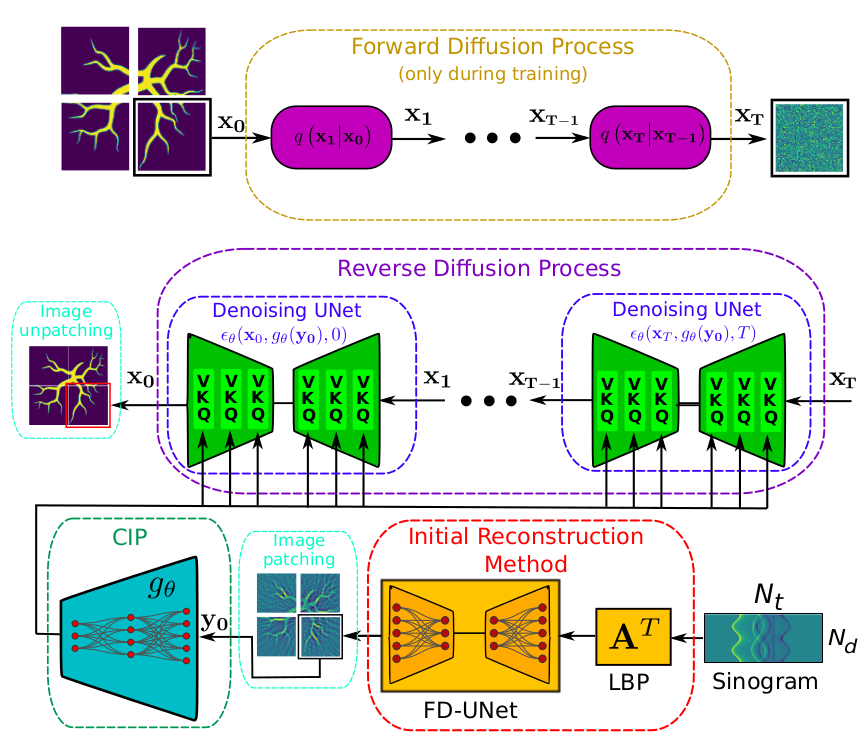

# DAROAT
This repository provides the architecture of the diffusion assisted reconstruction method (DAR) developed to increase the quality of optoacoustic tomography images.

Our proposal is to use a conditional diffusion model to improve the image quality reconstructed with a standard and well-proven method. The main idea is to use the image reconstructed by this well-proven method as conditional information to a diffusion model that will enhance the final image and eliminate possible artifacts besides increasing resolution (if desired).  Three major blocks can be identified in the proposed method: 

1) the initial well-proved reconstruction method,
2) the conditional information preprocessing (CIP), and
3) the conditional diffusion model in reduced dimension.

In Fig. 1 a depiction of the different blocks and their interconnections is presented



##### Figure 1. The forward diffusion process only acts during training phase. 3-tuples (V,K,Q) indicate the multi-head cross-attention mechanisms at each UNet's scales. Sinusoidal positional time embeddings are used for representing the time-steps in the reverse diffusion process.

### Initial reconstruction method

The measured sinogram is processed by matrix $\mathbf{A}^T$ generating an initial image corresponding to the LBP [Arridge_2016](https://arxiv.org/abs/1602.02027). This method is simple to implement and numerically efficient but usually introduces some artifacts.

```
FDUNet(
  (conv1): Conv2d(1, 32, kernel_size=(3, 3), stride=(1, 1), padding=same)
  (db1): DenseBlock(
    (dl1): DenseLayer(
      (conv1): Conv2d(32, 32, kernel_size=(1, 1), stride=(1, 1), padding=same)
      (conv2): Conv2d(32, 8, kernel_size=(3, 3), stride=(1, 1), padding=same)
      (relu): ReLU()
      (lnorm1): LayerNorm((32, 128, 128), eps=1e-05, elementwise_affine=True)
      (lnorm2): LayerNorm((8, 128, 128), eps=1e-05, elementwise_affine=True)
    )
    (dl2): DenseLayer(
      (conv1): Conv2d(40, 32, kernel_size=(1, 1), stride=(1, 1), padding=same)
      (conv2): Conv2d(32, 8, kernel_size=(3, 3), stride=(1, 1), padding=same)
      (relu): ReLU()
      (lnorm1): LayerNorm((32, 128, 128), eps=1e-05, elementwise_affine=True)
      (lnorm2): LayerNorm((8, 128, 128), eps=1e-05, elementwise_affine=True)
    )
    (dl3): DenseLayer(
      (conv1): Conv2d(48, 32, kernel_size=(1, 1), stride=(1, 1), padding=same)
      (conv2): Conv2d(32, 8, kernel_size=(3, 3), stride=(1, 1), padding=same)
      (relu): ReLU()
      (lnorm1): LayerNorm((32, 128, 128), eps=1e-05, elementwise_affine=True)
      (lnorm2): LayerNorm((8, 128, 128), eps=1e-05, elementwise_affine=True)
    )
    (dl4): DenseLayer(
      (conv1): Conv2d(56, 32, kernel_size=(1, 1), stride=(1, 1), padding=same)
      (conv2): Conv2d(32, 8, kernel_size=(3, 3), stride=(1, 1), padding=same)
      (relu): ReLU()
      (lnorm1): LayerNorm((32, 128, 128), eps=1e-05, elementwise_affine=True)
      (lnorm2): LayerNorm((8, 128, 128), eps=1e-05, elementwise_affine=True)
    )
  )
  (db2): DenseBlock(
    (dl1): DenseLayer(
      (conv1): Conv2d(64, 64, kernel_size=(1, 1), stride=(1, 1), padding=same)
      (conv2): Conv2d(64, 16, kernel_size=(3, 3), stride=(1, 1), padding=same)
      (relu): ReLU()
      (lnorm1): LayerNorm((64, 64, 64), eps=1e-05, elementwise_affine=True)
      (lnorm2): LayerNorm((16, 64, 64), eps=1e-05, elementwise_affine=True)
    )
    (dl2): DenseLayer(
      (conv1): Conv2d(80, 64, kernel_size=(1, 1), stride=(1, 1), padding=same)
      (conv2): Conv2d(64, 16, kernel_size=(3, 3), stride=(1, 1), padding=same)
      (relu): ReLU()
      (lnorm1): LayerNorm((64, 64, 64), eps=1e-05, elementwise_affine=True)
      (lnorm2): LayerNorm((16, 64, 64), eps=1e-05, elementwise_affine=True)
    )
    (dl3): DenseLayer(
      (conv1): Conv2d(96, 64, kernel_size=(1, 1), stride=(1, 1), padding=same)
      (conv2): Conv2d(64, 16, kernel_size=(3, 3), stride=(1, 1), padding=same)
      (relu): ReLU()
      (lnorm1): LayerNorm((64, 64, 64), eps=1e-05, elementwise_affine=True)
      (lnorm2): LayerNorm((16, 64, 64), eps=1e-05, elementwise_affine=True)
    )
    (dl4): DenseLayer(
      (conv1): Conv2d(112, 64, kernel_size=(1, 1), stride=(1, 1), padding=same)
      (conv2): Conv2d(64, 16, kernel_size=(3, 3), stride=(1, 1), padding=same)
      (relu): ReLU()
      (lnorm1): LayerNorm((64, 64, 64), eps=1e-05, elementwise_affine=True)
      (lnorm2): LayerNorm((16, 64, 64), eps=1e-05, elementwise_affine=True)
    )
  )
  (db3): DenseBlock(
    (dl1): DenseLayer(
      (conv1): Conv2d(128, 128, kernel_size=(1, 1), stride=(1, 1), padding=same)
      (conv2): Conv2d(128, 32, kernel_size=(3, 3), stride=(1, 1), padding=same)
      (relu): ReLU()
      (lnorm1): LayerNorm((128, 32, 32), eps=1e-05, elementwise_affine=True)
      (lnorm2): LayerNorm((32, 32, 32), eps=1e-05, elementwise_affine=True)
    )
    (dl2): DenseLayer(
      (conv1): Conv2d(160, 128, kernel_size=(1, 1), stride=(1, 1), padding=same)
      (conv2): Conv2d(128, 32, kernel_size=(3, 3), stride=(1, 1), padding=same)
      (relu): ReLU()
      (lnorm1): LayerNorm((128, 32, 32), eps=1e-05, elementwise_affine=True)
      (lnorm2): LayerNorm((32, 32, 32), eps=1e-05, elementwise_affine=True)
    )
    (dl3): DenseLayer(
      (conv1): Conv2d(192, 128, kernel_size=(1, 1), stride=(1, 1), padding=same)
      (conv2): Conv2d(128, 32, kernel_size=(3, 3), stride=(1, 1), padding=same)
      (relu): ReLU()
      (lnorm1): LayerNorm((128, 32, 32), eps=1e-05, elementwise_affine=True)
      (lnorm2): LayerNorm((32, 32, 32), eps=1e-05, elementwise_affine=True)
    )
    (dl4): DenseLayer(
      (conv1): Conv2d(224, 128, kernel_size=(1, 1), stride=(1, 1), padding=same)
      (conv2): Conv2d(128, 32, kernel_size=(3, 3), stride=(1, 1), padding=same)
      (relu): ReLU()
      (lnorm1): LayerNorm((128, 32, 32), eps=1e-05, elementwise_affine=True)
      (lnorm2): LayerNorm((32, 32, 32), eps=1e-05, elementwise_affine=True)
    )
  )
  (db4): DenseBlock(
    (dl1): DenseLayer(
      (conv1): Conv2d(256, 256, kernel_size=(1, 1), stride=(1, 1), padding=same)
      (conv2): Conv2d(256, 64, kernel_size=(3, 3), stride=(1, 1), padding=same)
      (relu): ReLU()
      (lnorm1): LayerNorm((256, 16, 16), eps=1e-05, elementwise_affine=True)
      (lnorm2): LayerNorm((64, 16, 16), eps=1e-05, elementwise_affine=True)
    )
    (dl2): DenseLayer(
      (conv1): Conv2d(320, 256, kernel_size=(1, 1), stride=(1, 1), padding=same)
      (conv2): Conv2d(256, 64, kernel_size=(3, 3), stride=(1, 1), padding=same)
      (relu): ReLU()
      (lnorm1): LayerNorm((256, 16, 16), eps=1e-05, elementwise_affine=True)
      (lnorm2): LayerNorm((64, 16, 16), eps=1e-05, elementwise_affine=True)
    )
    (dl3): DenseLayer(
      (conv1): Conv2d(384, 256, kernel_size=(1, 1), stride=(1, 1), padding=same)
      (conv2): Conv2d(256, 64, kernel_size=(3, 3), stride=(1, 1), padding=same)
      (relu): ReLU()
      (lnorm1): LayerNorm((256, 16, 16), eps=1e-05, elementwise_affine=True)
      (lnorm2): LayerNorm((64, 16, 16), eps=1e-05, elementwise_affine=True)
    )
    (dl4): DenseLayer(
      (conv1): Conv2d(448, 256, kernel_size=(1, 1), stride=(1, 1), padding=same)
      (conv2): Conv2d(256, 64, kernel_size=(3, 3), stride=(1, 1), padding=same)
      (relu): ReLU()
      (lnorm1): LayerNorm((256, 16, 16), eps=1e-05, elementwise_affine=True)
      (lnorm2): LayerNorm((64, 16, 16), eps=1e-05, elementwise_affine=True)
    )
  )
  (db5): DenseBlock(
    (dl1): DenseLayer(
      (conv1): Conv2d(512, 512, kernel_size=(1, 1), stride=(1, 1), padding=same)
      (conv2): Conv2d(512, 128, kernel_size=(3, 3), stride=(1, 1), padding=same)
      (relu): ReLU()
      (lnorm1): LayerNorm((512, 8, 8), eps=1e-05, elementwise_affine=True)
      (lnorm2): LayerNorm((128, 8, 8), eps=1e-05, elementwise_affine=True)
    )
    (dl2): DenseLayer(
      (conv1): Conv2d(640, 512, kernel_size=(1, 1), stride=(1, 1), padding=same)
      (conv2): Conv2d(512, 128, kernel_size=(3, 3), stride=(1, 1), padding=same)
      (relu): ReLU()
      (lnorm1): LayerNorm((512, 8, 8), eps=1e-05, elementwise_affine=True)
      (lnorm2): LayerNorm((128, 8, 8), eps=1e-05, elementwise_affine=True)
    )
    (dl3): DenseLayer(
      (conv1): Conv2d(768, 512, kernel_size=(1, 1), stride=(1, 1), padding=same)
      (conv2): Conv2d(512, 128, kernel_size=(3, 3), stride=(1, 1), padding=same)
      (relu): ReLU()
      (lnorm1): LayerNorm((512, 8, 8), eps=1e-05, elementwise_affine=True)
      (lnorm2): LayerNorm((128, 8, 8), eps=1e-05, elementwise_affine=True)
    )
    (dl4): DenseLayer(
      (conv1): Conv2d(896, 512, kernel_size=(1, 1), stride=(1, 1), padding=same)
      (conv2): Conv2d(512, 128, kernel_size=(3, 3), stride=(1, 1), padding=same)
      (relu): ReLU()
      (lnorm1): LayerNorm((512, 8, 8), eps=1e-05, elementwise_affine=True)
      (lnorm2): LayerNorm((128, 8, 8), eps=1e-05, elementwise_affine=True)
    )
  )
  (maxpool): MaxPool2d(kernel_size=2, stride=2, padding=0, dilation=1, ceil_mode=False)
  (up1): UpBlock(
    (up): ConvTranspose2d(1024, 512, kernel_size=(2, 2), stride=(2, 2))
    (conv1): Conv2d(1024, 256, kernel_size=(1, 1), stride=(1, 1), padding=same)
  )
  (db6): DenseBlock(
    (dl1): DenseLayer(
      (conv1): Conv2d(256, 256, kernel_size=(1, 1), stride=(1, 1), padding=same)
      (conv2): Conv2d(256, 64, kernel_size=(3, 3), stride=(1, 1), padding=same)
      (relu): ReLU()
      (lnorm1): LayerNorm((256, 16, 16), eps=1e-05, elementwise_affine=True)
      (lnorm2): LayerNorm((64, 16, 16), eps=1e-05, elementwise_affine=True)
    )
    (dl2): DenseLayer(
      (conv1): Conv2d(320, 256, kernel_size=(1, 1), stride=(1, 1), padding=same)
      (conv2): Conv2d(256, 64, kernel_size=(3, 3), stride=(1, 1), padding=same)
      (relu): ReLU()
      (lnorm1): LayerNorm((256, 16, 16), eps=1e-05, elementwise_affine=True)
      (lnorm2): LayerNorm((64, 16, 16), eps=1e-05, elementwise_affine=True)
    )
    (dl3): DenseLayer(
      (conv1): Conv2d(384, 256, kernel_size=(1, 1), stride=(1, 1), padding=same)
      (conv2): Conv2d(256, 64, kernel_size=(3, 3), stride=(1, 1), padding=same)
      (relu): ReLU()
      (lnorm1): LayerNorm((256, 16, 16), eps=1e-05, elementwise_affine=True)
      (lnorm2): LayerNorm((64, 16, 16), eps=1e-05, elementwise_affine=True)
    )
    (dl4): DenseLayer(
      (conv1): Conv2d(448, 256, kernel_size=(1, 1), stride=(1, 1), padding=same)
      (conv2): Conv2d(256, 64, kernel_size=(3, 3), stride=(1, 1), padding=same)
      (relu): ReLU()
      (lnorm1): LayerNorm((256, 16, 16), eps=1e-05, elementwise_affine=True)
      (lnorm2): LayerNorm((64, 16, 16), eps=1e-05, elementwise_affine=True)
    )
  )
  (up2): UpBlock(
    (up): ConvTranspose2d(512, 256, kernel_size=(2, 2), stride=(2, 2))
    (conv1): Conv2d(512, 128, kernel_size=(1, 1), stride=(1, 1), padding=same)
  )
  (db7): DenseBlock(
    (dl1): DenseLayer(
      (conv1): Conv2d(128, 128, kernel_size=(1, 1), stride=(1, 1), padding=same)
      (conv2): Conv2d(128, 32, kernel_size=(3, 3), stride=(1, 1), padding=same)
      (relu): ReLU()
      (lnorm1): LayerNorm((128, 32, 32), eps=1e-05, elementwise_affine=True)
      (lnorm2): LayerNorm((32, 32, 32), eps=1e-05, elementwise_affine=True)
    )
    (dl2): DenseLayer(
      (conv1): Conv2d(160, 128, kernel_size=(1, 1), stride=(1, 1), padding=same)
      (conv2): Conv2d(128, 32, kernel_size=(3, 3), stride=(1, 1), padding=same)
      (relu): ReLU()
      (lnorm1): LayerNorm((128, 32, 32), eps=1e-05, elementwise_affine=True)
      (lnorm2): LayerNorm((32, 32, 32), eps=1e-05, elementwise_affine=True)
    )
    (dl3): DenseLayer(
      (conv1): Conv2d(192, 128, kernel_size=(1, 1), stride=(1, 1), padding=same)
      (conv2): Conv2d(128, 32, kernel_size=(3, 3), stride=(1, 1), padding=same)
      (relu): ReLU()
      (lnorm1): LayerNorm((128, 32, 32), eps=1e-05, elementwise_affine=True)
      (lnorm2): LayerNorm((32, 32, 32), eps=1e-05, elementwise_affine=True)
    )
    (dl4): DenseLayer(
      (conv1): Conv2d(224, 128, kernel_size=(1, 1), stride=(1, 1), padding=same)
      (conv2): Conv2d(128, 32, kernel_size=(3, 3), stride=(1, 1), padding=same)
      (relu): ReLU()
      (lnorm1): LayerNorm((128, 32, 32), eps=1e-05, elementwise_affine=True)
      (lnorm2): LayerNorm((32, 32, 32), eps=1e-05, elementwise_affine=True)
    )
  )
  (up3): UpBlock(
    (up): ConvTranspose2d(256, 128, kernel_size=(2, 2), stride=(2, 2))
    (conv1): Conv2d(256, 64, kernel_size=(1, 1), stride=(1, 1), padding=same)
  )
  (db8): DenseBlock(
    (dl1): DenseLayer(
      (conv1): Conv2d(64, 64, kernel_size=(1, 1), stride=(1, 1), padding=same)
      (conv2): Conv2d(64, 16, kernel_size=(3, 3), stride=(1, 1), padding=same)
      (relu): ReLU()
      (lnorm1): LayerNorm((64, 64, 64), eps=1e-05, elementwise_affine=True)
      (lnorm2): LayerNorm((16, 64, 64), eps=1e-05, elementwise_affine=True)
    )
    (dl2): DenseLayer(
      (conv1): Conv2d(80, 64, kernel_size=(1, 1), stride=(1, 1), padding=same)
      (conv2): Conv2d(64, 16, kernel_size=(3, 3), stride=(1, 1), padding=same)
      (relu): ReLU()
      (lnorm1): LayerNorm((64, 64, 64), eps=1e-05, elementwise_affine=True)
      (lnorm2): LayerNorm((16, 64, 64), eps=1e-05, elementwise_affine=True)
    )
    (dl3): DenseLayer(
      (conv1): Conv2d(96, 64, kernel_size=(1, 1), stride=(1, 1), padding=same)
      (conv2): Conv2d(64, 16, kernel_size=(3, 3), stride=(1, 1), padding=same)
      (relu): ReLU()
      (lnorm1): LayerNorm((64, 64, 64), eps=1e-05, elementwise_affine=True)
      (lnorm2): LayerNorm((16, 64, 64), eps=1e-05, elementwise_affine=True)
    )
    (dl4): DenseLayer(
      (conv1): Conv2d(112, 64, kernel_size=(1, 1), stride=(1, 1), padding=same)
      (conv2): Conv2d(64, 16, kernel_size=(3, 3), stride=(1, 1), padding=same)
      (relu): ReLU()
      (lnorm1): LayerNorm((64, 64, 64), eps=1e-05, elementwise_affine=True)
      (lnorm2): LayerNorm((16, 64, 64), eps=1e-05, elementwise_affine=True)
    )
  )
  (up4): UpBlock(
    (up): ConvTranspose2d(128, 64, kernel_size=(2, 2), stride=(2, 2))
    (conv1): Conv2d(128, 32, kernel_size=(1, 1), stride=(1, 1), padding=same)
  )
  (db9): DenseBlock(
    (dl1): DenseLayer(
      (conv1): Conv2d(32, 32, kernel_size=(1, 1), stride=(1, 1), padding=same)
      (conv2): Conv2d(32, 8, kernel_size=(3, 3), stride=(1, 1), padding=same)
      (relu): ReLU()
      (lnorm1): LayerNorm((32, 128, 128), eps=1e-05, elementwise_affine=True)
      (lnorm2): LayerNorm((8, 128, 128), eps=1e-05, elementwise_affine=True)
    )
    (dl2): DenseLayer(
      (conv1): Conv2d(40, 32, kernel_size=(1, 1), stride=(1, 1), padding=same)
      (conv2): Conv2d(32, 8, kernel_size=(3, 3), stride=(1, 1), padding=same)
      (relu): ReLU()
      (lnorm1): LayerNorm((32, 128, 128), eps=1e-05, elementwise_affine=True)
      (lnorm2): LayerNorm((8, 128, 128), eps=1e-05, elementwise_affine=True)
    )
    (dl3): DenseLayer(
      (conv1): Conv2d(48, 32, kernel_size=(1, 1), stride=(1, 1), padding=same)
      (conv2): Conv2d(32, 8, kernel_size=(3, 3), stride=(1, 1), padding=same)
      (relu): ReLU()
      (lnorm1): LayerNorm((32, 128, 128), eps=1e-05, elementwise_affine=True)
      (lnorm2): LayerNorm((8, 128, 128), eps=1e-05, elementwise_affine=True)
    )
    (dl4): DenseLayer(
      (conv1): Conv2d(56, 32, kernel_size=(1, 1), stride=(1, 1), padding=same)
      (conv2): Conv2d(32, 8, kernel_size=(3, 3), stride=(1, 1), padding=same)
      (relu): ReLU()
      (lnorm1): LayerNorm((32, 128, 128), eps=1e-05, elementwise_affine=True)
      (lnorm2): LayerNorm((8, 128, 128), eps=1e-05, elementwise_affine=True)
    )
  )
  (conv2): Conv2d(64, 1, kernel_size=(1, 1), stride=(1, 1), padding=same)
)
```
